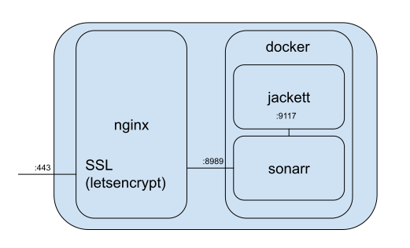

# Dockerfile and vestacp templates for sonarr

## _(my)vestacp config and docker-compose file to run sonarr and jackett using SSL_
These are files to help setup [sonarr](https://sonarr.tv/) and [jackett](https://github.com/Jackett/Jackett) using the [linuxserver.io](https://www.linuxserver.io/) docker images run on a [vestacp](https://myvestacp.com/) machine.

This will allow you to setup a server where you can search and monitor tv show torrents using sonarr on your own domain with vesta managed SSL.

## Overview

This configuration will create the following structure:

Only allowing https to connect to sonarr. Jackett will only be accessible to sonarr and the ports will not be exposed.
Configuration of jackett needs to be done by either temporary expose the ports, or preconfigure somewhere else and copy the files to the jackett_config directory.

## Installation

1. Install [docker](https://docs.docker.com/engine/install/debian/) on your vesta machine
2. Install [docker-compose](https://docs.docker.com/compose/install/) on your vesta machine
3. Copy the [docker-compose.yml] file to a directory of your choice
5. Start the sonarr and jacket containers using `docker-compose up -d --build` in the directory where your docker-compose.yml is located
6. Copy the [vesta-nginx-template] files to your vesta template directory `/usr/local/vesta/data/templates/web/nginx/`
7. Create a new site in vestacp, enable SSL and use the `sonarr-8989` proxy template
8. If jackett is configured you can add it to sonarr using it's internal docker hostname, eg: `http://jackett:9117/api/v2.0/indexers/eztv/results/torznab/`

### Configuration

To be able to configure jackett, take down the containers using `docker-compose down`. And add the following to the compose file under `jacket:`:
``yml
    ports:
      - 9117:9117
``
This will forward port 9117 and you'll be able to configure jackett using http.

When all is configured you can remove the ports again and do a `docker-compose down` and `docker-compose up -d` to hide jackett from the world.

